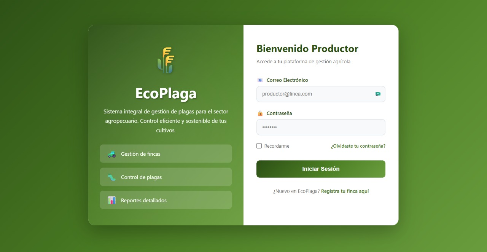

# 🌱 EcoPlaga - Sistema Inteligente de Gestión de Plagas Agrícolas


<div align="center">
  
  <p><em>Transformando la agricultura con tecnología inteligente</em></p>
</div>

---

## 📋 Tabla de Contenidos

- [Descripción del Proyecto](#-descripción-del-proyecto)
- [Problema y Solución](#-problema-y-solución)
- [Características Principales](#-características-principales)
- [Tecnologías Utilizadas](#️-tecnologías-utilizadas)
- [Instalación y Configuración](#-instalación-y-configuración)
- [Estructura del Proyecto](#-estructura-del-proyecto)
- [Uso de la Aplicación](#-uso-de-la-aplicación)
- [API Endpoints](#-api-endpoints)
- [Análisis de Datos](#-análisis-de-datos)
- [Docker](#-docker)
- [Roadmap](#-roadmap)
- [Contribución](#-contribución)
- [Licencia](#-licencia)
- [Contacto](#-contacto)

---

## 📌 Descripción del Proyecto

**EcoPlaga** es una plataforma web full-stack diseñada para ayudar a pequeños y medianos agricultores en la gestión integral de plagas agrícolas. La aplicación permite registrar, monitorear y analizar incidencias de plagas en cultivos, generando recomendaciones inteligentes basadas en análisis de datos con **Pandas** y **Numpy**.

### 🎯 Objetivos del Proyecto

**Objetivo General:**
> Desarrollar una plataforma web integral que permita a los agricultores gestionar, analizar y visualizar información sobre plagas agrícolas, mejorando la toma de decisiones y reduciendo pérdidas en la producción.

**Objetivos Específicos:**
1. ✅ Implementar sistema CRUD completo para cultivos, plagas, incidencias y tratamientos
2. ✅ Diseñar módulo de autenticación seguro con JWT
3. ✅ Desarrollar análisis de datos con Pandas/Numpy para detectar patrones
4. ✅ Crear dashboard interactivo con visualizaciones en tiempo real
5. ✅ Generar alertas automáticas y recomendaciones personalizadas
6. ✅ Implementar exportación de reportes en formato CSV
7. ✅ Desplegar la aplicación usando Docker

---

## 🔍 Problema y Solución

### 🚨 Problemática

Los agricultores enfrentan desafíos significativos:

- **Falta de registro sistemático** de incidencias de plagas
- **Ausencia de análisis histórico** para identificar patrones
- **Dificultad para evaluar** la efectividad de tratamientos
- **Pérdidas económicas** por falta de prevención
- **Acceso limitado** a herramientas digitales especializadas

### 💡 Solución Propuesta

EcoPlaga ofrece:

- 📊 **Dashboard inteligente** con estadísticas en tiempo real
- 🔔 **Alertas automáticas** basadas en severidad y frecuencia
- 📈 **Análisis de tendencias** usando machine learning básico
- 💊 **Registro de tratamientos** con seguimiento de efectividad
- 📥 **Exportación de reportes** para toma de decisiones
- 🌐 **Acceso web** desde cualquier dispositivo

---

## ✨ Características Principales

### 🔐 Autenticación y Seguridad
- Sistema de registro e inicio de sesión
- Tokens JWT para sesiones seguras
- Protección de rutas y endpoints
- Encriptación de contraseñas con bcrypt

### 🌾 Gestión de Cultivos
- CRUD completo de cultivos
- Clasificación por tipo (cereales, hortalizas, frutas, etc.)
- Búsqueda y filtrado en tiempo real

### 🐛 Catálogo de Plagas
- Base de datos de plagas comunes
- Descripciones detalladas
- Sistema de búsqueda avanzado

### ⚠️ Registro de Incidencias
- Documentación de plagas detectadas
- Nivel de severidad (Baja, Media, Alta, Crítica)
- Asociación con cultivos específicos
- Registro de fecha y ubicación

### 💊 Tratamientos Aplicados
- Historial de tratamientos
- Descripción de productos utilizados
- Seguimiento de aplicaciones por plaga

### 📊 Dashboard Inteligente
- Estadísticas generales en tiempo real
- Gráficos de incidencias recientes
- Top plagas más frecuentes
- Visualización de tendencias

### 💡 Recomendaciones con IA
- Análisis con Pandas y Numpy
- Alertas automáticas según patrones
- Sugerencias de tratamiento priorizadas
- Cálculo de nivel de riesgo por plaga

### 📥 Exportación de Datos
- Generación de reportes CSV
- Datos listos para análisis externo

---

## 🛠️ Tecnologías Utilizadas

### Backend
```python
- FastAPI 0.100.1      # Framework web asíncrono
- SQLAlchemy 2.0.22    # ORM para base de datos
- Pydantic 1.10.12     # Validación de datos
- Python-Jose 3.3.0    # Manejo de JWT
- Passlib 1.7.4        # Encriptación de contraseñas
- Pandas 2.2.3         # Análisis de datos
- Numpy 1.26.4         # Cálculos numéricos
```

### Frontend
```javascript
- HTML5, CSS3, JavaScript (Vanilla)
- Fetch API para comunicación con backend
- Diseño responsive y moderno
```

### Base de Datos
```sql
- SQLite (desarrollo)
- PostgreSQL (producción - opcional)
- Asyncpg para operaciones asíncronas
```

### DevOps
```docker
- Docker & Docker Compose
- Uvicorn (servidor ASGI)
- Git & GitHub
```

---

## 🚀 Instalación y Configuración

### Prerrequisitos

- Python 3.11+
- pip
- Git
- Docker (opcional)

### Instalación Local

1. **Clonar el repositorio**
```bash
git clone https://github.com/tu-usuario/ecoplaga.git
cd ecoplaga
```

2. **Crear entorno virtual**
```bash
python -m venv venv

# Windows
venv\Scripts\activate

# Linux/Mac
source venv/bin/activate
```

3. **Instalar dependencias**
```bash
pip install -r requirements.txt
```

4. **Configurar variables de entorno**
```bash
# Crear archivo .env en la raíz
SECRET_KEY=tu_clave_secreta_aqui
DATABASE_URL=sqlite+aiosqlite:///./ecoplaga.db
```

5. **Ejecutar la aplicación**
```bash
uvicorn backend.app.main:app --reload
```

6. **Acceder a la aplicación**
```
http://localhost:8000
```

### Instalación con Docker

1. **Construir y ejecutar contenedor**
```bash
docker-compose up --build
```

2. **Acceder a la aplicación**
```
http://localhost:8000
```

---

## 📁 Estructura del Proyecto

```
EcoPlaga/
├── backend/
│   └── app/
│       ├── models/          # Modelos de base de datos
│       ├── routers/         # Endpoints de la API
│       ├── schemas/         # Schemas de validación
│       ├── services/        # Lógica de negocio
│       ├── utils/           # Utilidades y seguridad
│       ├── database.py      # Configuración de BD
│       ├── config.py        # Variables de entorno
│       └── main.py          # Punto de entrada
├── frontend/
│   ├── static/
│   │   ├── css/            # Estilos
│   │   ├── js/             # JavaScript
│   │   └── img/            # Imágenes
│   └── templates/          # Páginas HTML
├── data/                   # Datos de muestra
├── tests/                  # Pruebas unitarias
├── Dockerfile
├── docker-compose.yml
├── requirements.txt
└── README.md
```

Ver más detalles en [flujo.md](flujo.md)

---

## 📖 Uso de la Aplicación

### 1. Registro e Inicio de Sesión
- Crear cuenta con email y contraseña
- Login con credenciales
- Token JWT se almacena automáticamente

### 2. Dashboard
- Ver estadísticas generales
- Consultar incidencias recientes
- Identificar plagas más frecuentes

### 3. Gestión de Cultivos
- Agregar cultivos de tu finca
- Clasificar por tipo
- Editar o eliminar registros

### 4. Catálogo de Plagas
- Registrar nuevas plagas
- Agregar descripciones detalladas
- Consultar información existente

### 5. Registro de Incidencias
- Reportar plagas detectadas
- Seleccionar cultivo y plaga afectada
- Definir nivel de severidad
- Agregar observaciones

### 6. Tratamientos
- Documentar tratamientos aplicados
- Asociar con plagas específicas
- Mantener historial completo

### 7. Recomendaciones
- Consultar alertas automáticas
- Ver análisis de tendencias
- Obtener sugerencias de tratamiento

---

## 🔌 API Endpoints

### Autenticación
```http
POST   /auth/register     # Registro de usuario
POST   /auth/login        # Inicio de sesión
```

### Cultivos
```http
GET    /cultivos/         # Listar cultivos
POST   /cultivos/         # Crear cultivo
GET    /cultivos/{id}     # Obtener cultivo
PUT    /cultivos/{id}     # Actualizar cultivo
DELETE /cultivos/{id}     # Eliminar cultivo
```

### Plagas
```http
GET    /plagas/           # Listar plagas
POST   /plagas/           # Crear plaga
GET    /plagas/{id}       # Obtener plaga
PUT    /plagas/{id}       # Actualizar plaga
DELETE /plagas/{id}       # Eliminar plaga
```

### Incidencias
```http
GET    /incidencias/          # Listar incidencias
POST   /incidencias/          # Crear incidencia
GET    /incidencias/{id}      # Obtener incidencia
PUT    /incidencias/{id}      # Actualizar incidencia
DELETE /incidencias/{id}      # Eliminar incidencia
GET    /incidencias/export/csv # Exportar CSV
```

### Tratamientos
```http
GET    /tratamientos/     # Listar tratamientos
POST   /tratamientos/     # Crear tratamiento
GET    /tratamientos/{id} # Obtener tratamiento
PUT    /tratamientos/{id} # Actualizar tratamiento
DELETE /tratamientos/{id} # Eliminar tratamiento
```

### Recomendaciones
```http
GET    /recomendaciones/analisis    # Análisis completo
GET    /recomendaciones/alertas     # Alertas activas
GET    /recomendaciones/sugerencias # Sugerencias de tratamiento
```

Ver documentación interactiva en: `http://localhost:8000/docs`

---

## 📊 Análisis de Datos

### Funcionalidades con Pandas/Numpy

**Resumen por Plaga:**
- Conteo de incidencias por tipo de plaga
- Distribución por nivel de severidad
- Frecuencia de aparición

**Estadísticas Generales:**
- Total de incidencias
- Plagas únicas detectadas
- Cultivos afectados
- Severidad promedio

**Análisis de Tendencias:**
- Comparación temporal (últimos 7 vs 7 días anteriores)
- Cálculo de porcentaje de cambio
- Detección de patrones de crecimiento

**Generación de Alertas:**
- Incidencias críticas recientes
- Plagas con alta frecuencia
- Tendencias al alza
- Propagación entre cultivos

**Recomendaciones Inteligentes:**
- Priorización según severidad
- Sugerencias de tratamiento
- Acciones preventivas

---

## 🐳 Docker

### Comandos Útiles

```bash
# Construir imagen
docker-compose build

# Iniciar contenedores
docker-compose up

# Iniciar en segundo plano
docker-compose up -d

# Ver logs
docker-compose logs -f

# Detener contenedores
docker-compose down

# Reiniciar
docker-compose restart
```

---

## 🗺️ Roadmap

### ✅ Fase 1 - Completada
- [x] Sistema de autenticación
- [x] CRUD de cultivos, plagas, incidencias, tratamientos
- [x] Dashboard con estadísticas
- [x] Análisis con Pandas/Numpy
- [x] Recomendaciones automáticas
- [x] Dockerización

### 🚧 Fase 2 - En Progreso
- [ ] Tests unitarios completos
- [ ] Integración con PostgreSQL
- [ ] Deploy en servidor cloud
- [ ] Documentación API extendida

### 🔮 Fase 3 - Futuras Mejoras
- [ ] Aplicación móvil (React Native)
- [ ] Notificaciones push
- [ ] Integración con APIs meteorológicas
- [ ] Machine Learning para predicción de plagas
- [ ] Sistema de geolocalización de incidencias
- [ ] Gráficos avanzados con Chart.js
- [ ] Multi-idioma (i18n)
- [ ] Modo oscuro

---

## 🤝 Contribución

Las contribuciones son bienvenidas. Por favor:

1. Fork el proyecto
2. Crea una rama (`git checkout -b feature/nueva-funcionalidad`)
3. Commit tus cambios (`git commit -m 'Agregar nueva funcionalidad'`)
4. Push a la rama (`git push origin feature/nueva-funcionalidad`)
5. Abre un Pull Request

---

## 📄 Licencia

Este proyecto está bajo la Licencia MIT. Ver archivo `LICENSE` para más detalles.

---

## 👥 Equipo

Desarrollado con ❤️ por el equipo EcoPlaga

---

## 📞 Contacto

- **Email:** jorgeandreyhernandez26@gmail.com
- **GitHub:** [@tockdoog](https://github.com/tockdoog)
- **LinkedIn:** [Andrei Hernández](https://www.linkedin.com/in/andreihern%C3%A1ndez-27592a257/)

---

<div align="center">
  <p>⭐ Si te gusta este proyecto, dale una estrella en GitHub ⭐</p>
  <p>Hecho con 🌱 para apoyar la agricultura sostenible</p>
</div>